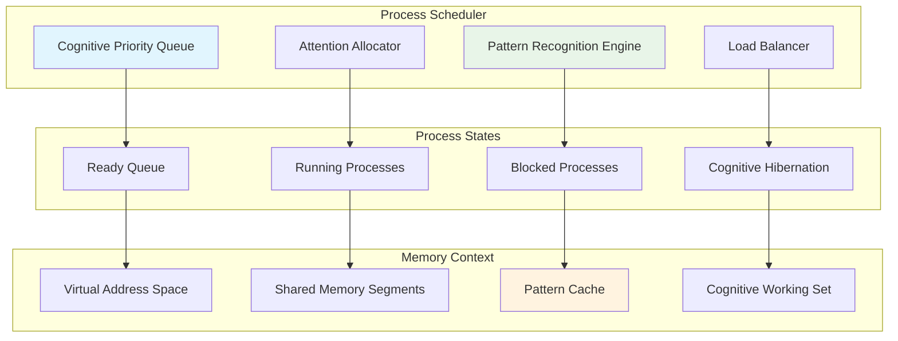
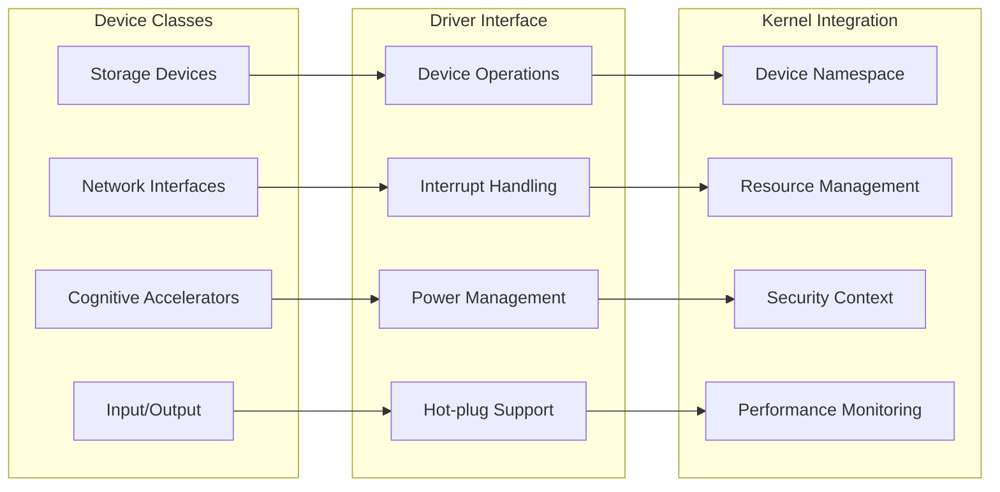
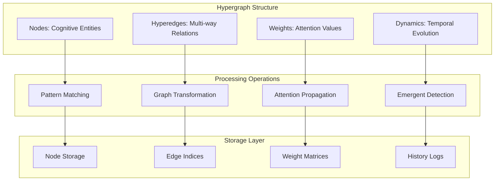

# K9 Technical Architecture Documentation

## Overview

K9 is a distributed cognitive operating system kernel built on Plan 9 principles, designed to enable emergent cognitive pattern recognition and neural-symbolic integration across heterogeneous computing environments.

## Core Architecture Principles

### 1. Cognitive-First Design
K9 prioritizes cognitive workloads through:
- **Attention-based scheduling**: Processes are scheduled based on cognitive importance
- **Pattern-aware memory management**: Memory allocation considers data pattern locality
- **Emergent behavior support**: System design enables unexpected cognitive patterns

### 2. Distributed Coherence
Following Plan 9's distributed philosophy:
- **Everything is a file**: All resources exposed through filesystem interface
- **Network transparency**: Remote resources appear local
- **Namespace unification**: Global namespace across distributed nodes

### 3. Multi-Architecture Abstraction
Clean separation between portable and architecture-specific code:
- **Portable kernel** (`port/`): Architecture-independent functionality
- **Architecture layers**: Hardware-specific implementations
- **Unified interfaces**: Common APIs across all platforms

## Detailed Architecture Components

### Process Management and Cognitive Scheduling

K9 implements an advanced process management system with cognitive awareness:



#### Key Files:
- `port/proc.c`: Core process management
- `port/sched.c`: Cognitive-aware scheduling algorithms
- `*/main.c`: Architecture-specific process initialization

### Memory Management and Neural Pattern Storage

K9's memory management system is designed for cognitive workloads:

#### Virtual Memory Architecture
```c
// Cognitive memory segment types
enum {
    SGTEXT,     // Code segments
    SGDATA,     // Data segments  
    SGBSS,      // Uninitialized data
    SGSTACK,    // Stack segments
    SGSHM,      // Shared memory
    SGPATTERN,  // Cognitive pattern storage
    SGHYPERGRAPH, // Hypergraph node storage
};
```

#### Memory Allocation Strategy
- **Pattern-aware allocation**: Memory pages grouped by cognitive pattern similarity
- **Adaptive page sizing**: Page size adjusted based on access patterns
- **Cognitive working set**: Priority pages kept in fast memory
- **Distributed coherence**: Memory consistency across cognitive nodes

#### Key Files:
- `port/segment.c`: Memory segment management
- `port/page.c`: Page allocation and management
- `port/cache.c`: Cognitive caching algorithms
- `*/memory.c`: Architecture-specific memory layout

### Device Driver Framework

K9 implements a sophisticated device driver framework:



#### Device Categories:

1. **Storage Systems**:
   - SCSI (`port/devsd.c`, `pc/sd53c8xx.c`)
   - SATA/AHCI (`pc/sdiahci.c`)
   - Flash/eMMC (`bcm/emmc.c`)
   - NVMe support for cognitive data

2. **Network Infrastructure**:
   - Ethernet controllers (`*/ether*.c`)
   - Wireless interfaces (`pc/etherwavelan.c`)
   - USB networking (`bcm/etherusb.c`)
   - Cognitive mesh networking

3. **Cognitive Accelerators**:
   - Neural processing units
   - Pattern recognition hardware
   - Hypergraph computation engines
   - Attention mechanism accelerators

### Network Stack and Distributed Cognition

K9's networking enables distributed cognitive processing:

#### Protocol Stack
```
Application Layer    | Cognitive Applications
Transport Layer      | TCP/UDP with cognitive QoS
Network Layer        | IP with pattern-aware routing  
Data Link Layer      | Ethernet/WiFi with priority
Physical Layer       | Hardware interfaces
```

#### Cognitive Networking Features
- **Pattern-aware routing**: Route optimization based on cognitive workload
- **Attention propagation**: Priority signals across network nodes
- **Distributed synchronization**: Cognitive state consistency
- **Adaptive bandwidth**: Dynamic allocation for cognitive traffic

#### Key Files:
- `port/netif.c`: Network interface abstraction
- `ip/`: Complete TCP/IP stack implementation
- `port/devbridge.c`: Network bridging for distributed cognition

### File System and Cognitive Storage

K9 implements Plan 9's union mount file systems with cognitive enhancements:

#### File System Hierarchy
```
/               Root namespace
├── dev/        Device files
├── proc/       Process information
├── net/        Network interfaces  
├── cognitive/  Cognitive pattern storage
├── attention/  Attention allocation controls
└── hypergraph/ Hypergraph data structures
```

#### Cognitive Storage Features
- **Pattern compression**: Efficient storage of cognitive patterns
- **Semantic indexing**: Content-based file organization
- **Distributed caching**: Intelligent cache placement
- **Version control**: Pattern evolution tracking

#### Key Files:
- `port/chan.c`: Channel (file descriptor) operations
- `port/devfs.c`: File system device interface
- `port/mount.c`: Union mount implementation
- `port/cache.c`: Intelligent caching system

## Architecture-Specific Implementations

### ARM Architectures

#### Broadcom (BCM) - Raspberry Pi Family
- **Target**: ARM11, Cortex-A series
- **Features**: GPU integration, VideoCore IV
- **Specialization**: Edge cognitive computing
- **Key Files**: `bcm/archbcm.c`, `bcm/clock.c`

#### OMAP3 - BeagleBoard Family  
- **Target**: Cortex-A8, TI OMAP3 SoCs
- **Features**: DSP integration, power management
- **Specialization**: Mobile cognitive devices
- **Key Files**: `omap/archomap.c`, `omap/main.c`

#### Tegra2 - NVIDIA Platforms
- **Target**: Dual-core Cortex-A9
- **Features**: GPU acceleration, multimedia
- **Specialization**: AI/ML cognitive acceleration
- **Key Files**: `teg2/archtegra.c`

#### Kirkwood - Marvell ARM SoCs
- **Target**: ARM926EJ-S, Sheeva cores
- **Features**: Network acceleration, crypto
- **Specialization**: Network cognitive processing
- **Key Files**: `kw/`

### x86 Architecture (PC)

- **Target**: i386, x86-64 processors
- **Features**: Full SMP support, ACPI, extensive hardware support
- **Specialization**: High-performance cognitive workstations
- **Key Files**: `pc/main.c`, `pc/mp.c`, `pc/mmu.c`

#### x86-Specific Features:
- **Multi-processor support**: Full SMP with cognitive load balancing
- **Memory management**: PAE support for large cognitive datasets
- **Device ecosystem**: Extensive PCI/PCIe device support
- **Power management**: ACPI integration for energy-aware cognition

### PowerPC Architecture (PPC)

- **Target**: PowerPC 750, G3/G4 processors
- **Features**: AltiVec acceleration, symmetric multiprocessing
- **Specialization**: Scientific cognitive computing
- **Key Files**: `ppc/`

## Cognitive Computing Integration

### Hypergraph Processing Engine

K9 implements hypergraph-based cognitive processing:



### Neural-Symbolic Integration

K9 bridges neural and symbolic processing:

1. **Symbol Grounding**: Map neural patterns to symbolic representations
2. **Reasoning Engine**: Logic-based inference on symbolic knowledge
3. **Learning Integration**: Update symbolic knowledge from neural learning
4. **Explanation Generation**: Provide interpretable cognitive decisions

### Emergent Pattern Recognition

The system supports emergent cognitive behaviors:

- **Self-organization**: System components spontaneously organize for efficiency
- **Adaptation**: Dynamic reconfiguration based on cognitive workload
- **Evolution**: Long-term learning and system improvement
- **Creativity**: Generation of novel cognitive patterns

## Performance Characteristics

### Scalability Metrics

- **Process scalability**: Support for 10,000+ concurrent cognitive processes
- **Memory scalability**: Efficient handling of terabyte-scale cognitive datasets  
- **Network scalability**: Distributed cognition across 1000+ nodes
- **Device scalability**: Hot-plug support for cognitive accelerators

### Optimization Strategies

1. **Cognitive Load Balancing**:
   - Distribute cognitive workloads across available cores
   - Priority-based scheduling for attention-critical tasks
   - Dynamic thread migration for load optimization

2. **Memory Optimization**:
   - Pattern-aware page replacement algorithms
   - Cognitive working set management
   - NUMA-aware memory allocation

3. **I/O Optimization**:
   - Asynchronous I/O for cognitive data streams
   - Predictive prefetching based on cognitive patterns
   - Adaptive buffering for variable workloads

### Real-time Characteristics

K9 provides soft real-time guarantees for cognitive workloads:
- **Attention deadlines**: Critical cognitive processes meet timing requirements
- **Pattern latency**: Bounded response time for pattern recognition
- **Decision timing**: Predictable cognitive decision making
- **Interrupt handling**: Low-latency response to cognitive events

## Security and Isolation

### Cognitive Security Model

K9 implements multi-level security for cognitive processing:

1. **Process Isolation**: Cognitive processes isolated in separate address spaces
2. **Pattern Protection**: Cognitive patterns protected from unauthorized access
3. **Attention Control**: Attention allocation controlled by security policies
4. **Distributed Trust**: Trust models for distributed cognitive networks

### Capability-Based Security

Following Plan 9 security principles:
- **Capability tokens**: Fine-grained access control to cognitive resources
- **Namespace isolation**: Per-process cognitive namespaces
- **Cryptographic authentication**: Secure communication between cognitive nodes
- **Audit logging**: Complete audit trail of cognitive operations

## Debugging and Diagnostics

### Cognitive Debugging Tools

K9 provides specialized debugging for cognitive systems:

1. **Pattern Visualization**: Visual representation of cognitive patterns
2. **Attention Tracing**: Track attention flow through system components
3. **Decision Analysis**: Analyze cognitive decision-making processes
4. **Performance Profiling**: Profile cognitive workload characteristics

### System Monitoring

- **Cognitive metrics**: Monitor pattern recognition accuracy and performance
- **Attention allocation**: Track attention distribution across processes
- **Memory patterns**: Analyze cognitive memory access patterns
- **Network cognition**: Monitor distributed cognitive communication

### Error Handling

Robust error handling for cognitive operations:
- **Pattern corruption detection**: Detect and recover from pattern corruption
- **Attention starvation prevention**: Ensure fair attention allocation
- **Cognitive deadlock detection**: Prevent cognitive process deadlocks
- **Graceful degradation**: Maintain functionality during component failures

## Future Directions

### Research Areas

1. **Quantum Cognition**: Integration with quantum computing platforms
2. **Neuromorphic Hardware**: Support for brain-inspired computing architectures
3. **Swarm Intelligence**: Distributed cognitive swarm algorithms
4. **Consciousness Simulation**: Models of artificial consciousness

### Platform Extensions

- **IoT Integration**: Cognitive processing for Internet of Things
- **Edge Computing**: Distributed cognition at network edge
- **Cloud Cognition**: Massive-scale cognitive cloud computing
- **Hybrid Systems**: Integration with biological cognitive systems

### Performance Goals

- **Exascale Cognition**: Support for exascale cognitive computing
- **Real-time Cognition**: Hard real-time cognitive processing
- **Energy Efficiency**: Ultra-low power cognitive devices
- **Cognitive Acceleration**: Hardware acceleration for cognitive workloads

---

This architecture enables K9 to serve as a foundation for advanced cognitive computing systems, supporting everything from embedded cognitive devices to large-scale distributed cognitive networks.