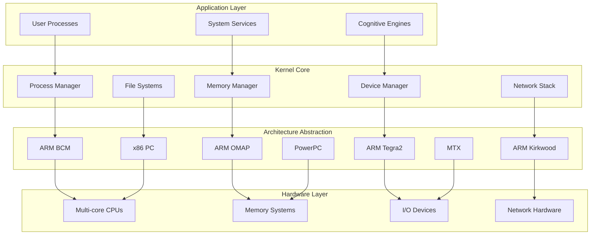
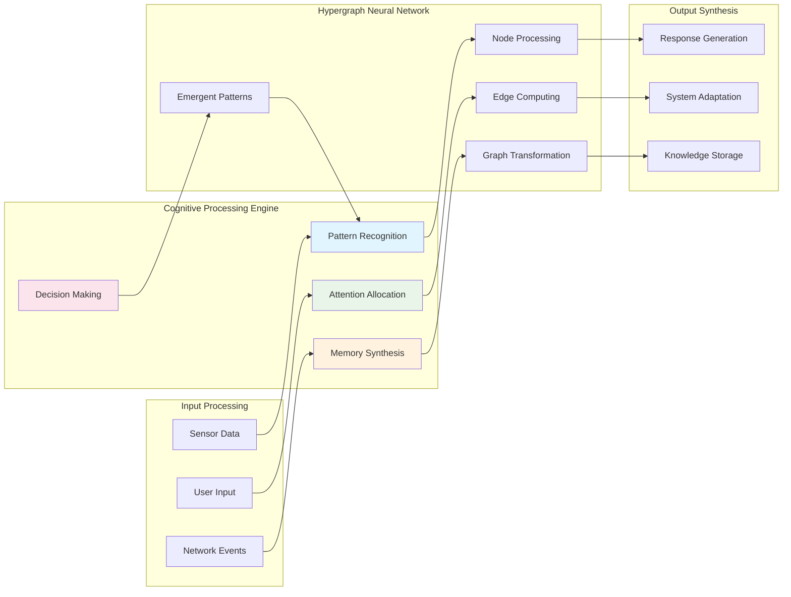

# K9: Distributed Cognitive Operating System Kernel

K9 is an advanced, multi-architecture operating system kernel designed for cognitive synergy and emergent pattern recognition. Built upon Plan 9 principles, K9 enables distributed comprehension and neural-symbolic integration across heterogeneous computing environments.

## 🧠 Cognitive Vision

K9 facilitates **cognitive synergy** through systemic intelligence architecture, enabling:
- Adaptive attention allocation across distributed systems
- Emergent cognitive pattern recognition
- Neural-symbolic integration for advanced reasoning
- Hypergraph-based pattern representations
- Dynamic resource orchestration for optimal performance

## 🏗️ System Architecture

K9 follows a modular, multi-architecture design supporting diverse computing platforms:



## 🎯 Core Components

### Architecture Support
- **ARM BCM** (`bcm/`): Broadcom ARM processors (Raspberry Pi family)
- **ARM OMAP** (`omap/`): TI OMAP3 SoCs (BeagleBoard family)
- **ARM Tegra2** (`teg2/`): NVIDIA Tegra2 dual-core ARM processors
- **ARM Kirkwood** (`kw/`): Marvell Kirkwood ARM SoCs
- **x86 PC** (`pc/`): Standard x86/x64 personal computers
- **PowerPC** (`ppc/`): PowerPC processors
- **MTX** (`mtx/`): Specialized cognitive processing units

### Portable Kernel (`port/`)
The portable kernel provides architecture-independent functionality:
- **Process Management**: Advanced scheduling with cognitive workload awareness
- **Memory Management**: Unified virtual memory with distributed coherence
- **Device Framework**: Extensible device driver architecture
- **Network Stack**: Plan 9-style distributed networking
- **File Systems**: Union mount capabilities with cognitive caching

### Device Ecosystem
- **Storage**: SCSI, SATA, eMMC, NAND flash support
- **Networking**: Ethernet, wireless, USB networking
- **USB**: EHCI, OHCI, UHCI host controller support
- **Graphics**: VGA, framebuffer, hardware acceleration
- **Audio**: Digital audio processing capabilities

## 🔄 Data Flow and Cognitive Patterns



## 🚀 Getting Started

### Prerequisites
- Plan 9 development environment or cross-compilation tools
- Architecture-specific toolchain (ARM GCC, x86 GCC, etc.)
- Hardware platform or emulator

### Building K9

1. **Clone the repository**:
   ```bash
   git clone https://github.com/HyperCogWizard/k9.git
   cd k9
   ```

2. **Build for specific architecture**:
   ```bash
   # For x86 PC
   cd pc && mk
   
   # For ARM OMAP (BeagleBoard)
   cd omap && mk
   
   # For ARM BCM (Raspberry Pi)
   cd bcm && mk
   
   # Build all architectures
   mk all
   ```

3. **Install bootloader**:
   ```bash
   mk pcboot  # For x86 systems
   mk install # Install to target location
   ```

### Configuration

K9 uses Plan 9-style configuration files:

**plan9.ini** (x86 example):
```ini
bootfile=k9.gz
console=0
*nomp=1
*maxmem=512
vgasize=1024x768x16
```

**Boot process**:
1. Bootloader loads kernel image
2. Architecture-specific initialization
3. Device enumeration and driver loading
4. Process spawning and system services
5. Cognitive pattern initialization

## 🔧 Development and Extension

### Adding New Architecture Support

1. Create new directory `arch/` with:
   - `main.c`: Architecture initialization
   - `dat.h`: Architecture-specific data structures
   - `fns.h`: Function prototypes
   - `mem.h`: Memory layout definitions
   - Device drivers in individual `.c` files

2. Update root `mkfile` to include new architecture

3. Implement required functions:
   - `archinit()`: Initialize architecture
   - `mpinit()`: Multi-processor support
   - `clockinit()`: Timer initialization

### Cognitive Engine Integration

K9's cognitive capabilities can be extended through:

1. **Pattern Recognition Modules**: Implement in `port/` for shared access
2. **Attention Mechanisms**: Extend scheduler with cognitive awareness
3. **Memory Synthesis**: Enhance caching with semantic understanding
4. **Hypergraph Processing**: Add graph computation primitives

### Device Driver Development

Follow Plan 9 device driver conventions:
- Implement standard operations: attach, walk, stat, open, close, read, write
- Use proper locking mechanisms for concurrent access
- Handle power management and error conditions
- Support hot-plug/removal where applicable

## 🧪 Testing and Validation

### Hardware Testing
- Boot on real hardware platforms
- Validate device enumeration
- Test multi-processor functionality
- Verify memory management

### Cognitive Testing
- Pattern recognition accuracy
- Attention allocation efficiency
- Memory synthesis effectiveness
- Emergent behavior validation

### Integration Testing
- Cross-architecture compatibility
- Distributed system coherence
- Network protocol compliance
- Performance benchmarking

## 📊 Performance and Optimization

K9 implements several optimization strategies:

- **Cognitive Load Balancing**: Distribute cognitive workloads across available cores
- **Adaptive Memory Management**: Dynamic allocation based on pattern recognition needs
- **Predictive Caching**: Cache data based on cognitive pattern predictions
- **Energy-Aware Scheduling**: Optimize for power consumption in mobile/embedded scenarios

## 🤝 Contributing

We welcome contributions to K9's cognitive operating system development:

### Guidelines
1. **Code Style**: Follow Plan 9 coding conventions
2. **Architecture**: Maintain clean separation between portable and arch-specific code
3. **Documentation**: Document cognitive algorithms and data structures
4. **Testing**: Provide comprehensive test coverage
5. **Review**: All changes undergo peer review for cognitive coherence

### Areas for Contribution
- **New Architecture Support**: Port to additional hardware platforms
- **Cognitive Algorithms**: Enhance pattern recognition and decision making
- **Device Drivers**: Support for new hardware devices
- **Performance Optimization**: Improve system efficiency
- **Documentation**: Enhance technical documentation and examples

### Submission Process
1. Fork the repository
2. Create feature branch with descriptive name
3. Implement changes following coding standards
4. Add comprehensive tests and documentation
5. Submit pull request with detailed description
6. Participate in code review process

## 📚 References and Further Reading

- [Plan 9 from Bell Labs](https://9p.io/plan9/)
- [Plan 9 Kernel Principles](https://9p.io/sys/doc/9.html)
- [Distributed Systems in Plan 9](https://9p.io/sys/doc/net/net.html)
- [Cognitive Computing Architectures](https://research.ibm.com/cognitive-computing/)
- [Neural-Symbolic Integration](https://www.neural-symbolic.org/)

## 📄 License

K9 is distributed under the Lucent Public License, maintaining compatibility with Plan 9 licensing terms while enabling cognitive computing research and development.

---

*K9: Where distributed cognition meets systems intelligence* 🧠⚡